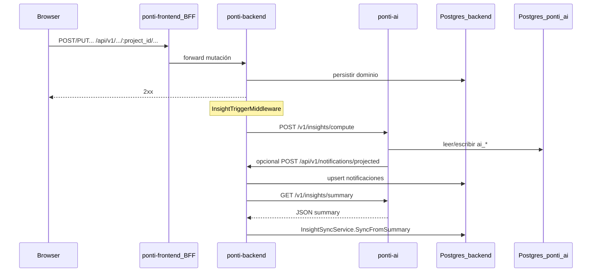

# Investigación: ecosistema Pablo, IA (Ponti vs Pymes), reutilización (`core` / `modules`)

**Propósito de este documento:** transferencia de contexto a otro asistente (p. ej. Claude) para que **no haga suposiciones** sobre límites de repos, flujos HTTP, duplicación de responsabilidades ni política de código reusable.

**Audiencia:** ingeniero de software o agente que deba proponer cambios arquitectónicos, alinear productos o refactorizar IA/notificaciones.

**Alcance:** ecosistema bajo `~/Projects/Pablo` — en particular **Ponti** (`ponti-backend`, `ponti-ai`, `ponti-frontend`), **Pymes** (monorepo), **`core`**, **`modules`**. No cubre en profundidad Nexus, ToolLab ni Medmory salvo mención de fronteras.

---

## 1. Instrucciones explícitas para el lector (agente)

1. **Tratar las tablas de rutas absolutas como fuente de verdad de ubicación** en disco; si el repo del usuario difiere, contrastar con búsqueda local.
2. **Separar siempre:**
   - **Hecho verificado** (estructura de carpetas, nombres de env, existencia de archivos descritos).
   - **Inferencia / recomendación** (marcadas en este doc como *Inferencia* o bajo sección "Recomendaciones").
3. **No asumir** que Ponti y Pymes comparten base de datos, despliegue ni dominio; solo comparten **ecosistema** y potencialmente **librerías** (`core`, `modules`).
4. **Regla de negocio del usuario (política de diseño):** crear o usar código reusable **solo cuando sea la opción óptima**; si factores (acoplamiento, tiempo, blast radius, semántica distinta) lo desaconsejan, **código particular del proyecto** es la decisión correcta.
5. **Reglas del repo `ponti-backend`** (resumen): cambios quirúrgicos; sin hardcode; migraciones SQL nuevas sin `ROUND()`; comentarios en español, código en inglés; no git/deploy sin autorización explícita; antes de implementar grandes cambios, alinear intención con el dueño del repo.

---

## 2. Glosario

| Término | Significado en este documento |
|--------|-------------------------------|
| **Pablo** | Carpeta raíz del ecosistema local: `/home/pablo/Projects/Pablo`. |
| **core** | Repo `/home/pablo/Projects/Pablo/core` — librería de capacidades **agnósticas de producto** (Go modules bajo `github.com/devpablocristo/core/...`). Incluye `core/ai/go` y distribución Python **`devpablocristo-core-ai`** (`core/ai/python`). |
| **modules** | Repo `/home/pablo/Projects/Pablo/modules` — paquetes **versionados individualmente** (npm o `go.mod` por subcarpeta), montados sobre `core`, **sin lógica de negocio** de Ponti/Pymes. |
| **ponti-backend** | API Go del producto Ponti (agro). Workspace habitual del usuario. |
| **ponti-ai** | Servicio Python FastAPI del producto Ponti; DB propia; LLM; rutas bajo `/v1/`. |
| **ponti-frontend** | UI + BFF Express; proxy hacia backend para rutas `/api/v1/ai/*`. |
| **pymes** | Monorepo `/home/pablo/Projects/Pablo/pymes` — SaaS multi-vertical PyMEs: `pymes-core/backend`, verticales, `frontend/`, `ai/`. |
| **BFF** | Backend for frontend — en Ponti, capa Express en `ponti-frontend` que reenvía al API Go. |
| **Insight / copilot / chat** | Capacidades de IA en producto; nombres de rutas varían entre Ponti y Pymes. |

---

## 3. Mapa de repos y fronteras (hecho + política)

### 3.1 Documentación canónica del ecosistema

| Documento | Ruta absoluta | Contenido |
|-----------|---------------|-----------|
| Mapa de repos y reglas cortas | `/home/pablo/Projects/Pablo/ECOSYSTEM.md` | Qué es cada repo; regla: **dominio en `internal/` del producto**; **entre productos solo HTTP/contrato**, no import de dominio. |
| Arquitectura formal | `/home/pablo/Projects/Pablo/ARCHITECTURE.md` | Capas; unidades de despliegue; política de duplicación (subir a `core` si agnóstico; `shared` si solo del producto; duplicación mínima aceptable). |

### 3.2 Tabla de productos relevantes

| Repo / carpeta | Ruta absoluta | Rol |
|----------------|---------------|-----|
| core | `/home/pablo/Projects/Pablo/core` | Librería compartida; sin app de producto. |
| modules | `/home/pablo/Projects/Pablo/modules` | UI y helpers reutilizables; versionado por paquete (`VERSION` por implementación). |
| ponti (tres piezas) | `/home/pablo/Projects/Pablo/ponti/ponti-backend`, `ponti-ai`, `ponti-frontend` | Producto Ponti. |
| pymes | `/home/pablo/Projects/Pablo/pymes` | Producto PyMEs; **un** servicio `ai/` en el monorepo (no `pymes-core/ai` separado). |

**Política explícita (ECOSYSTEM):** entre `pymes`, `ponti`, `nexus` la integración es por **API estable**, timeouts, auth; **no** importar paquetes de dominio de otro repo.

---

## 4. Objetivo estratégico que originó la investigación (contexto de negocio)

- **Intención expresada por el usuario:** extrapolar el enfoque del producto **Pymes** (incl. `core`, `modules`, `ai/` unificado) hacia **Ponti**, o **reemplazar** piezas del sistema actual por un diseño **alineado** al de Pymes, **sin** mezclar dominios.
- **Intención de ingeniería:** maximizar **código reusable** (`core`, `modules`) cuando sea **óptimo**; en caso contrario, **implementación particular** en el proyecto.
- **Riesgo a evitar:** confundir "mismo lenguaje / misma lib Python `runtime`" con "un solo servicio o un solo dominio".

*Inferencia:* cualquier migración debe decidir explícitamente **topología HTTP** (quién ve el navegador, dónde viven las API keys, SSE) además de **reuso de librería**.

---

## 5. Ponti: arquitectura de IA y notificaciones (detalle operativo)

### 5.1 Flujo principal (chat / insights / copilot)

**Orden verificado en código y estructura de repos:**

```text
[Navegador]
  → ponti-frontend: rutas /api/v1/ai/* (BFF Express, p.ej. api/src/routes/ai.ts)
  → ponti-backend: rutas manager /ai/* con headers X-API-KEY, X-User-Id, X-Project-Id
  → ponti-backend internal/ai: Handler Gin bajo {APIBaseURL}/ai
  → ponti-ai: /v1/insights/*, /v1/copilot/*, /v1/chat/* con X-SERVICE-KEY, X-USER-ID, X-PROJECT-ID
```

**Archivos clave (ponti-backend):**

| Pieza | Ruta |
|-------|------|
| Arranque middleware + cliente AI | `/home/pablo/Projects/Pablo/ponti/ponti-backend/cmd/api/http_server.go` |
| Cliente HTTP hacia ponti-ai | `/home/pablo/Projects/Pablo/ponti/ponti-backend/internal/ai/client.go` |
| Casos de uso (proxy) | `/home/pablo/Projects/Pablo/ponti/ponti-backend/internal/ai/usecases/usecases.go` |
| Rutas HTTP Gin | `/home/pablo/Projects/Pablo/ponti/ponti-backend/internal/ai/handler.go` |
| Trigger post-mutación | `/home/pablo/Projects/Pablo/ponti/ponti-backend/internal/ai/trigger.go` |
| Sync summary → inbox | `/home/pablo/Projects/Pablo/ponti/ponti-backend/internal/notification/service.go` (`InsightSyncService.SyncFromSummary`) |
| Config env AI | `/home/pablo/Projects/Pablo/ponti/ponti-backend/cmd/config/ai.go` |

**Comportamiento del trigger (`InsightTriggerMiddleware`):**

- Tras **POST/PUT/PATCH/DELETE** con respuesta **2xx**.
- Si el path incluye **`project_id`** y **no** es ruta bajo `/ai/`.
- Efecto: async, con **throttle** por proyecto → `POST` ponti-ai `/v1/insights/compute` → si OK, `GET` `/v1/insights/summary` → `SyncFromSummary` hacia repositorio de notificaciones.

**Archivos clave (ponti-ai):**

| Pieza | Ruta |
|-------|------|
| App FastAPI | `/home/pablo/Projects/Pablo/ponti/ponti-ai/app/main.py` |
| Rutas insights | `/home/pablo/Projects/Pablo/ponti/ponti-ai/adapters/inbound/api/routes/insights.py` |
| Cliente HTTP hacia ponti-backend | `/home/pablo/Projects/Pablo/ponti/ponti-ai/adapters/outbound/http/ponti_backend_client.py` |
| Config | `/home/pablo/Projects/Pablo/ponti/ponti-ai/app/config.py` |

**Rutas típicas ponti-ai (prefijo `/v1`):** `POST /v1/insights/compute`, `GET /v1/insights/summary`, `GET /v1/insights/{entity_type}/{entity_id}`, `POST /v1/insights/{insight_id}/actions`, rutas copilot (`explain`, `why`, `next-steps`), chat y stream (según flags `CHAT_ENABLED`, `COPILOT_ENABLED`).

**LLM:** uso de paquete **`runtime.*`** instalado (alineado con **`devpablocristo-core-ai`** / código en `core/ai/python`); chat: factory (stub, Gemini, Ollama) según configuración.

**Lectura de dominio desde ponti-ai:** herramientas de chat orientadas a **solo lectura** sobre el API Ponti (declaraciones en código de contexto chat, p. ej. `ponti_tools` / `run_ponti_chat.py`).

### 5.2 Punto crítico: dos vías hacia notificaciones proyectadas en Ponti

**Hecho:** coexisten al menos estos mecanismos:

1. **Pull/sync desde ponti-backend:** tras mutación exitosa, el middleware dispara compute + **GET summary** y **`InsightSyncService.SyncFromSummary`** persiste/actualiza notificaciones en la **DB del backend**.
2. **Push desde ponti-ai:** en `insights.py` existe constante de path **`/api/v1/notifications/projected`** y uso de **`PontiBackendClient`** para **POST** de notificaciones proyectadas hacia el backend cuando el resultado de compute incluye insights proyectados.

**Implicación para un agente:** antes de "unificar con Pymes" o simplificar, debe **modelarse explícitamente** si esto es **idempotencia intencional**, **doble canal redundante**, o **riesgo de condiciones de carrera**. *Inferencia:* conviene un diagrama de secuencia único y política de "source of truth" por `insight_id` o clave de deduplicación.

### 5.3 Documentación en ponti-backend

| Documento | Ruta |
|-----------|------|
| Uso GORM vs SQL | `/home/pablo/Projects/Pablo/ponti/ponti-backend/docs/ARCHITECTURE.md` — sección AI: flujo FE → BFF → Backend → Ponti AI; proxy; Ponti AI read-only sobre dominio y escritura `ai_*`; endpoints listados. |

---

## 6. Pymes: arquitectura de IA (contraste directo)

### 6.1 Topología HTTP respecto al navegador

**Hecho (documentado y reflejado en estructura):**

- El **frontend** de Pymes usa **`VITE_AI_API_URL`**: el SPA habla **directamente** con el servicio **`pymes/ai`** para chat y flujos asociados (no es obligatorio que todo pase por `pymes-core` como proxy BFF para el browser).
- **`pymes-core/backend`** tiene **`AI_SERVICE_URL`** y uso documentado hacia AI en flujos **internos** (p. ej. WhatsApp → `POST /v1/internal/customer-messaging/inbound`), es decir **servicio-a-servicio**, no sustituto del patrón BFF del Ponti para el SPA.

**Archivos de referencia:**

| Tema | Ruta |
|------|------|
| App FastAPI AI | `/home/pablo/Projects/Pablo/pymes/ai/src/main.py` |
| Config AI | `/home/pablo/Projects/Pablo/pymes/ai/src/config.py` |
| README monorepo (topología) | `/home/pablo/Projects/Pablo/pymes/README.md` |
| Integración core/modules | `/home/pablo/Projects/Pablo/pymes/docs/CORE_INTEGRATION.md` |
| Evolución / to-be IA | `/home/pablo/Projects/Pablo/pymes/docs/architecture/pymes-ai-evolution.md` |
| Ownership IA | `/home/pablo/Projects/Pablo/pymes/docs/AI_OWNERSHIP.md` |

### 6.2 Contratos HTTP representativos (Pymes)

- Chat: **`POST /v1/chat`**, listado y detalle de conversaciones (prefijo `/v1/chat` en routers).
- Notificaciones / insights hacia producto: **`POST /v1/notifications`** (nombre y cuerpo **no idénticos** al path Ponti `.../notifications/projected`).
- Interno: **`POST /v1/internal/customer-messaging/inbound`**, callbacks review, etc.
- Verticales y rutas públicas con `org_slug` según vertical.

### 6.3 Dependencia de `core` (Python)

- **`devpablocristo-core-ai`** y **`devpablocristo-httpserver`** en dependencias del servicio `ai/`.
- Imports **`runtime.*`** — misma familia que usa **ponti-ai**.

### 6.4 Ownership (resumen citado de docs Pymes)

- **Agnóstico de producto** → `core`.
- **Inteligencia de producto** (agents, prompts de dominio, orquestación específica) → **`ai/` del producto** (`pymes/ai` o `ponti-ai`).
- **Governance** (Review, etc.) → Nexus cuando aplica.
- **UI reusable sin dominio** → **`modules`**.

---

## 7. `core` y `modules`: qué reutiliza hoy cada mundo

### 7.1 core — IA

| Artefacto | Ruta |
|-----------|------|
| Contratos y providers LLM (Go) | `/home/pablo/Projects/Pablo/core/ai/go` — `contracts.go`, `llm.go`, `gemini.go`, `ollama.go`, etc. |
| Runtime Python publicable | `/home/pablo/Projects/Pablo/core/ai/python` — árbol `src/runtime/...` (chat, completions, providers, memory, observability, etc.) |

### 7.2 modules — IA (UI)

| Paquete | Ruta | npm |
|----------|------|-----|
| Consola AI (componentes React) | `/home/pablo/Projects/Pablo/modules/ai/console/ts` | `@devpablocristo/modules-ai-console` |

**Export público (índice):** `CopilotResponsePanel`, `InsightSummaryCards`, `InsightCardsList` (+ tipos asociados). Implementación en `.tsx` bajo el mismo paquete.

### 7.3 ponti-frontend — estado de dependencias (hecho verificado)

- **Sí se usan** en código: `@devpablocristo/modules-ui-filters`, `@devpablocristo/modules-ui-data-display`; también paquetes **`@devpablocristo/core-browser`**, **`core-http`**, **`core-authn`** (imports en TS/TSX).
- **`@devpablocristo/modules-ai-console`** aparece en **`package.json`** (y referencias en README/docker-compose) pero **no** hay `import` desde ese paquete en el código fuente TS/TSX buscado en la investigación → **dependencia declarada no utilizada** o preparación futura.
- La UI de insights/copilot/chat en Ponti se apoya en **rutas propias**, **`aiClient.ts`**, tipos y OpenAPI generado (`ponti-ai.openapi.ts`), no en los componentes de `modules-ai-console` al momento de la investigación.

*Recomendación para agente:* o bien **integrar** `modules-ai-console` con un adaptador de datos mínimo, o **eliminar** la dependencia para reducir ruido y tamaño de supply chain.

---

## 8. Matriz comparativa Ponti vs Pymes (IA)

| Aspecto | Ponti | Pymes |
|---------|--------|--------|
| Servicio IA | `ponti-ai` (repo separado bajo `ponti/`) | `pymes/ai` (carpeta del monorepo `pymes`) |
| Runtime Python compartido | Sí (`runtime` / `devpablocristo-core-ai`) | Sí |
| Navegador → IA | Vía **BFF + backend** (clave de servicio no expuesta al browser de la misma forma que URL directa a AI) | **Directo** a `ai/` con `VITE_AI_API_URL` |
| Core backend → AI | vía ponti-backend como proxy; trigger desde middleware | Selectivo (p. ej. WhatsApp inbound desde `pymes-core`) |
| Notificaciones / insights | `POST .../notifications/projected` + sync desde summary en backend | `POST /v1/notifications` + modelo de ownership en docs |
| Dominio | `project_id`, agro | org, verticales PyMEs |

---

## 9. Diagrama de secuencia — Ponti (mutación → inbox)



*Nota:* el orden exacto entre **push** desde AI y **pull** de summary puede depender de implementación; el diagrama muestra **ambas** relaciones para forzar la pregunta de diseño al lector.

---

## 10. Decisiones abiertas (para el siguiente agente)

1. **Canónico de notificaciones proyectadas en Ponti:** ¿una sola vía (push **o** pull) o ambas con contrato de idempotencia documentado?
2. **¿Migrar ponti-frontend a llamada directa al servicio AI** (estilo Pymes) o **mantener BFF+backend** por seguridad/operación?
3. **¿Homogeneizar paths y payloads** entre `POST /v1/notifications` (Pymes) y `POST .../notifications/projected` (Ponti) solo a nivel de **documentación** o vía **adaptador** en una capa común?
4. **¿Adoptar `modules-ai-console` en Ponti`** mapeando el JSON actual de summary a las props esperadas, o mantener UI custom?
5. **¿Qué subir a `core`?** Solo cuando exista **segundo consumidor** real o contrato estable entre productos (política del `ARCHITECTURE.md` y del usuario).

---

## 11. Checklist de verificación antes de implementar

- [ ] Leer `ECOSYSTEM.md` y `ARCHITECTURE.md` en la raíz Pablo.
- [ ] Leer `pymes/docs/AI_OWNERSHIP.md` y `pymes-ai-evolution.md` si el cambio toca ownership.
- [ ] Leer `ponti-backend/docs/ARCHITECTURE.md` sección AI.
- [ ] Trazar en código las dos vías de notificaciones Ponti (`insights.py` + `InsightSyncService`).
- [ ] Confirmar variables de entorno en `.env.example` de `ponti-backend`, `ponti-ai`, `ponti-frontend`, `pymes/ai`.
- [ ] No mezclar imports de dominio entre repos; integrar por HTTP y contratos.

---

## 12. Resumen ejecutivo (una pantalla)

- El ecosistema **Pablo** separa **`core`** (reusable agnóstico), **`modules`** (UI/SDK reusable), y **productos** (`pymes`, `ponti`, …) con **frontera HTTP**, no import de dominio cruzado.
- **Ponti** y **Pymes** **ya comparten** el runtime Python de IA vía **`devpablocristo-core-ai` / `runtime`**, pero **difieren** en cómo el **navegador** y el **core** alcanzan el servicio IA y en los **paths** de notificaciones.
- En Ponti hay **complejidad explícita** en **notificaciones**: posible **POST desde ponti-ai** al backend **y** **sync desde summary** en el backend tras compute; debe aclararse antes de refactor grande.
- **`modules-ai-console`** es candidato natural a **reuso en ponti-frontend** o a **depuración** de dependencias no usadas.
- La política del usuario **no** es "siempre abstractar": es **reutilizar cuando óptimo**; si no, **código particular del proyecto**.

---

*Fin del documento de handoff.*
